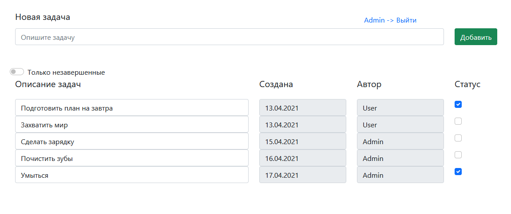

# Цель проекта
Проект создавался в качестве примера работы с Hibernate и паттернами, а также Lombok.
# Описание проекта
Проект представляет собой список дел и имеет всего одну страницу. Все задачи загружаются на клиент через Ajax. 
Добавляя новую задачу, мы отправляем через Ajax POST запрос, сохраняем в БД новую задачу и добавляем её в список без перегрузки страницы.
Описание и статус задачи можно изменить в обе стороны. Нажимая на галку мы изменяем статус задачи и отправляем информацию на сервер.
Переключатель "Только незавершенные" скрывает завершенные задачи.

# Запуск проекта
Для запуска потребуется PostgreSQL.
В resources вы найдете конфигурационный файл Hibernate в котором необходимо указать корректные данный для подключения к БД.
При необходимости, для создания таблиц, можете воспользоваться sql скриптом в resources.db.
Сконфигурировать Tomcat http://localhost:8080/todolist/
